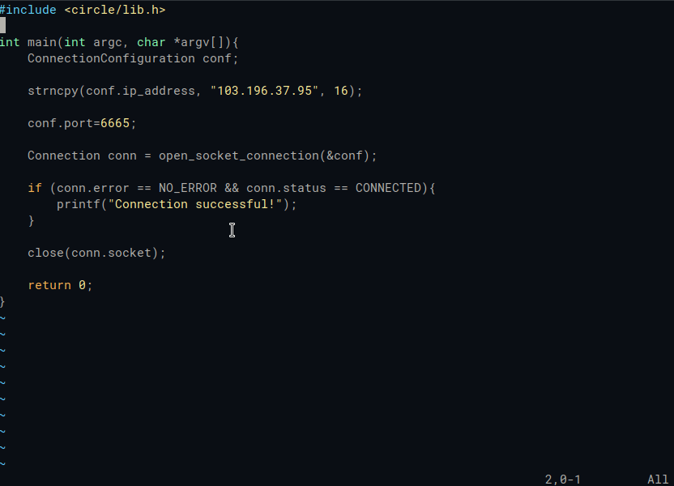

# capibara README

capibara-vim is the vim plugin for using Capibara documentation.

## Features

- Quick documentation lookup bound to `F2` based on the the crowd-sourced C library definitions contributed to Capibara.

- Code offline! Definitions are cached locally and only get resynced when you delete the cache or manually trigger a redownload.

## Commands

- You can manually call a lookup via the `capibara#CapibaraLookUp: CapibaraLookUp` command.

- You can manually trigger a redownload of the documentation via the `capibara#CapibaraRefreshDefinitions: CapibaraRefreshDefinitions` command.

- You can view plugin sponsorship and about info via the `capibara#CapibaraSponsorPlugin: CapibaraSponsorPlugin` command.

## Requirements

This extension utilizes the python and is compatible with `vim-plug`

## Extension Settings

This extension contributes the following settings:

- `~/.vim-capibara-definitions.json`: This is the filepath that the vim extension will downloaad and read definitions.

## Release Notes

### 1.0.0

Initial release of capibara-vim.

---

## For more information

- [Capibara](https://capibara.tools/)

**Enjoy!**
